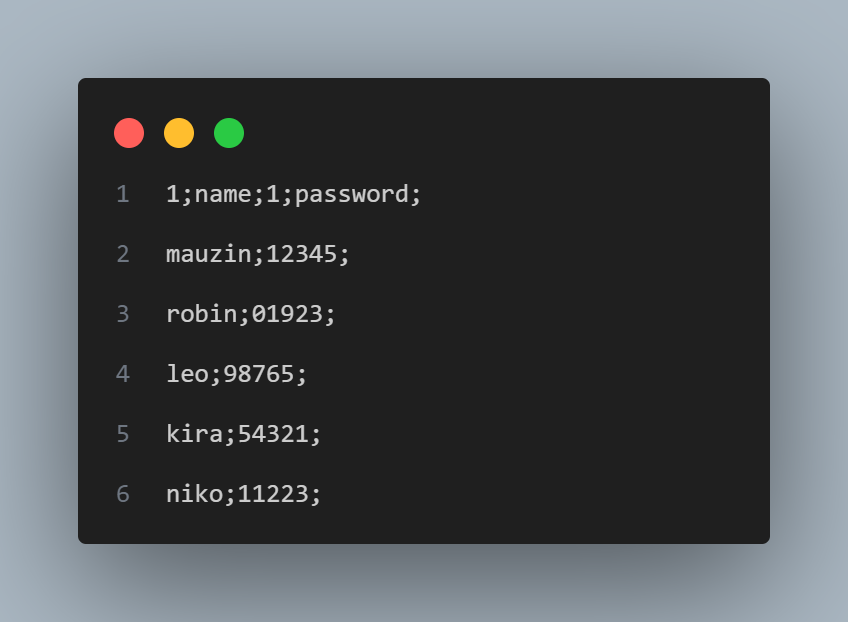

# 🚀 Local DB
A basic local DataBase implementation using TXT's and a basic text formatting.

The Current Model to store Data in the TXT is Like this:

Headers will always be on the first line.
Like:
| Header1 | Header1.1 |
|---------|-----------|
|  Data1  |  Data1.1  |
|  Data2  |  Data2.1  |
    
Tables store data in files separately from others tables.
Like:
users;
posts;

## 📦 Instalation
📌 **Steps:**
1. Clone the repository.
2. Compile using this command:
    ```sh
    g++ ./example/main.cpp ./src/*.cpp -o app
3. Run the *app.exe*.